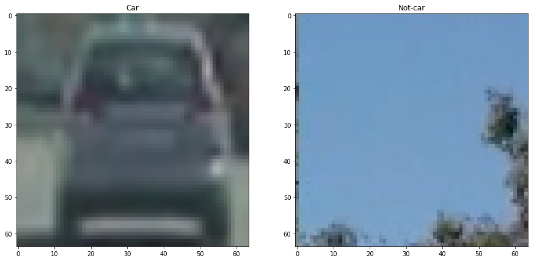
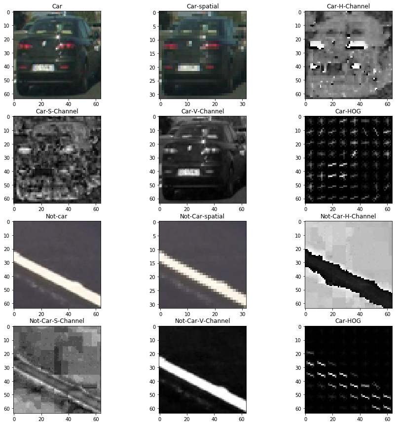

##Vehicle Detection Project

The goals / steps of this project are the following:

* Perform a Histogram of Oriented Gradients (HOG) feature extraction on a labeled training set of images and train a classifier Linear SVM classifier
* Optionally, you can also apply a color transform and append binned color features, as well as histograms of color, to your HOG feature vector. 
* Note: for those first two steps don't forget to normalize your features and randomize a selection for training and testing.
* Implement a sliding-window technique and use your trained classifier to search for vehicles in images.
* Run your pipeline on a video stream (start with the test_video.mp4 and later implement on full project_video.mp4) and create a heat map of recurring detections frame by frame to reject outliers and follow detected vehicles.
* Estimate a bounding box for vehicles detected.

---
###Creating Training and Test set
This step was very important for this project since just reading all the images and using train_test_split did not work well on training 
results. This is because images were present in sequence, so random splitting resulted in similar frames in training and validation set, 
which resulted in good validation results, but on test set performed very poor.
So I read in images from each folder and split the first 80% of images in order to training set and the rest 20% to validation set. This
ensures pictures dont repeat between training and validation set.

```
cars_dir = '/Users/SandeepGangundi/Documents/Courses/Udacity/Self_Driving_Car_ND/Term1/Udacity-CarND-Vehicle-Detection/vehicles/'
cars_train = []
cars_test = []
for dir in os.listdir(cars_dir):
    regex = cars_dir + "/" + dir + "/*png"
    cars_tmp = glob.glob(regex)
    split_index = int(len(cars_tmp)*0.8)
    tmp_train = cars_tmp[0:split_index]
    tmp_test = cars_tmp[split_index:len(cars_tmp)]
    cars_train = cars_train + tmp_train
    cars_test = cars_test + tmp_test

notcars_dir = '/Users/SandeepGangundi/Documents/Courses/Udacity/Self_Driving_Car_ND/Term1/Udacity-CarND-Vehicle-Detection/non-vehicles/'
notcars_train = []
notcars_test = []
for dir in os.listdir(notcars_dir):
    regex = notcars_dir + "/" + dir + "/*png"
    notcars_tmp = glob.glob(regex)
    split_index = int(len(notcars_tmp)*0.8)
    tmp_train = notcars_tmp[0:split_index]
    tmp_test = notcars_tmp[split_index:len(notcars_tmp)]
    notcars_train = notcars_train + tmp_train
    notcars_test = notcars_test + tmp_test

train_imgs = cars_train + notcars_train
test_imgs = cars_test + notcars_test
```
An example of cars and not cars image is below:

 
###Feature selection
####Spatial and Color Histogram features
For both spatial and color histogram features, I used HSV channel. For spatial I used spatial size of (32,32) and for histogram I kept 
the image size to (64,64) as that gave better results with training.
####HOG features
For HOG features, I again used HSV channel of input image and used orient = 9, pix_per_cell = 8, cell_per_block = 2 and hog_channel = 2.
I selected only channel 2, as that channel gave better results overall. If I selected all channel for HOG, it resulted in overfitting where
even though validation set gave better results buy many notcar features were detected as car in testing.

Below is a visualization of these features on the sample car and notcar image:

