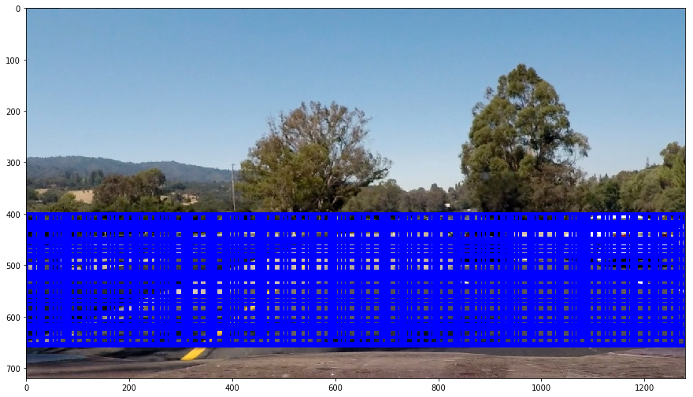

##Vehicle Detection Project

The goals / steps of this project are the following:

* Perform a Histogram of Oriented Gradients (HOG) feature extraction on a labeled training set of images and train a classifier Linear SVM classifier
* Optionally, you can also apply a color transform and append binned color features, as well as histograms of color, to your HOG feature vector. 
* Note: for those first two steps don't forget to normalize your features and randomize a selection for training and testing.
* Implement a sliding-window technique and use your trained classifier to search for vehicles in images.
* Run your pipeline on a video stream (start with the test_video.mp4 and later implement on full project_video.mp4) and create a heat map of recurring detections frame by frame to reject outliers and follow detected vehicles.
* Estimate a bounding box for vehicles detected.

---
###Creating Training and Test set
This step was very important for this project since just reading all the images and using train_test_split did not work well on training 
results. This is because images were present in sequence, so random splitting resulted in similar frames in training and validation set, 
which resulted in good validation results, but on test set performed very poor.
So I read in images from each folder and split the first 80% of images in order to training set and the rest 20% to validation set. This
ensures pictures dont repeat between training and validation set.

```
cars_dir = '/Users/SandeepGangundi/Documents/Courses/Udacity/Self_Driving_Car_ND/Term1/Udacity-CarND-Vehicle-Detection/vehicles/'
cars_train = []
cars_test = []
for dir in os.listdir(cars_dir):
    regex = cars_dir + "/" + dir + "/*png"
    cars_tmp = glob.glob(regex)
    split_index = int(len(cars_tmp)*0.8)
    tmp_train = cars_tmp[0:split_index]
    tmp_test = cars_tmp[split_index:len(cars_tmp)]
    cars_train = cars_train + tmp_train
    cars_test = cars_test + tmp_test

notcars_dir = '/Users/SandeepGangundi/Documents/Courses/Udacity/Self_Driving_Car_ND/Term1/Udacity-CarND-Vehicle-Detection/non-vehicles/'
notcars_train = []
notcars_test = []
for dir in os.listdir(notcars_dir):
    regex = notcars_dir + "/" + dir + "/*png"
    notcars_tmp = glob.glob(regex)
    split_index = int(len(notcars_tmp)*0.8)
    tmp_train = notcars_tmp[0:split_index]
    tmp_test = notcars_tmp[split_index:len(notcars_tmp)]
    notcars_train = notcars_train + tmp_train
    notcars_test = notcars_test + tmp_test

train_imgs = cars_train + notcars_train
test_imgs = cars_test + notcars_test
```
An example of cars and not cars image is below:

 
###Feature selection
####Spatial and Color Histogram features
For both spatial and color histogram features, I used HSV channel. For spatial I used spatial size of (32,32) and for histogram I kept 
the image size to (64,64) as that gave better results with training.
####HOG features
For HOG features, I again used HSV channel of input image and used orient = 9, pix_per_cell = 8, cell_per_block = 2 and hog_channel = 2.
I selected only channel 2, as that channel gave better results overall. If I selected all channel for HOG, it resulted in overfitting where even though validation set gave better results buy many notcar features were detected as car in testing. I also experimented with 
different values for # of orientations, block and cell size, but did not achieve any significant improvement in accuracy without overfitting the data.

I combined all these features into one single feature vector which was used for training and testing. Total there are 5028 features.

Below is a visualization of these features on the sample car and notcar image:


###Training model
I initially used SVM classifier but received very poor accuracy of around 50-60%. I went through the forum and discovered many people suggesting to try other classifiers. So I tried Random Forest Classifier and it gave much better accuracy. Finally I ended up with an accuracy of around 95%. I also tried modifying parameters of RFC and finally settled with (n_estimators=10, min_samples_leaf=2) for good results.

###Sliding Window Search
####Implementation of sliding window
This was very fun, in trying different parameter for sliding window and seeing how the results changed. I created the <b>get_windows_list</b> function to take in parameters like:
```
def get_windows_list(image, x_start_stop=[None, None], y_start_stop=[None, None], 
                    xy_overlap=(0.5, 0.5), win_sizes=[64]):
```
Below are the values I used for these parameters to get the windows:
y_start_stop = [400, 656]
xy_overlap = (0.75, 0.75)
win_sizes = [64, 96, 112]
y_start_stop makes sure we are only focussing on the road part of the image. I increased xy_overlap to 75% to make the heatmap more hot around our object of interest. And finally I selected different window sizes to consider the difference in car size when its near to camera than when it is far from it. These parameters led to overall 1603 search windows! Yes, the testing on the video was very slow because of this but the results look much better as compared to very few windows.



####Test images
As mentioned earlier, to improve the classifier, I switched to Random Forest instead of SVM with parameters (n_estimators=10, min_samples_leaf=2). Also properly selecting training and validation set was very important to get better results. Finally after combining spatial, color histogram and HOG features on test images and then running the classifier on it, I got below results on some test images:


###Video Implementation
####Video result
I have uploaded my final video, <b>project_video_output.mp4</b> to my git repo.

####Getting rid of False positives
As mentioned in the lecture videos, I used heatmap to get rid of false positives. I created a global variable that could store hot_windows (windows where cars appear) for the last 8 frames. It then combines these videos from previous 8 frames and generates a heat map. Since I am combining lot of previous frames, this gives less flickering results. I then thresholded that map to identify vehicle positions. I then used scipy.ndimage.measurements.label() to identify individual blobs in the heatmap. I then assumed each blob corresponded to a vehicle. I constructed bounding boxes to cover the area of each blob detected.

Here's an example result showing the heatmap from a series of frames of video, the result of scipy.ndimage.measurements.label() and the bounding boxes then overlaid on the last frame of video:
####Here are eight frames and their corresponding heatmaps:


####Here is the output of scipy.ndimage.measurements.label() on the integrated heatmap from all eight frames:


####Here is the resulting bounding boxes are drawn onto the last frame in the series:


###Discussion
Running the model on video file took a very long time. This will be the major improvement to do. Because when running the actual self driving model, we will be running it on live video stream and we cannot risk any delay in the output. It needs to be almost instantaneous. I will have to improve my feature selection and sliding window technique to reduce the run time a lot. 
I also notice sometimes the pipeline recognizes notcar features in the video as car, this could be due to poor classifier, so I will need to improve my classifier further to increase accuracy, may be gather more training data too.
I should also try smaller window sizes to search in the video, like 32 or smaller. This will help to detect cars that are far and the cars on the other side of the lane. Currently the labeled window for the cars on the other side of the lane is very big, so small window sizes will properly label those cars.
